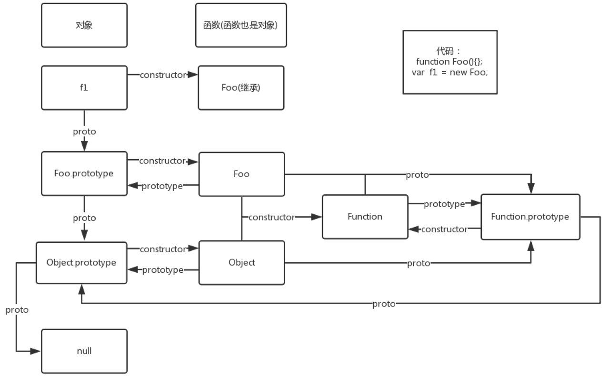

## prototype与__proto__区别?
    prototype(显式原型), 是通过调用构造函数而创建的那个对象实例的原型对象   
        作用:用来实现基于原型的继承与属性的共享
    __proto__(隐式原型), 指向构造该对象的构造函数的原型
        作用:构成原型链，同样用于实现基于原型的继承。可以通过__proto__实现向上查找
例子
```
function F(){console.log(123)}
a = new F()
b = {}
a.constructor === F //a的构造函数是F
a.constructor.prototype.constructor.prototype.constructo.....//可以无限循环下去
a.prototype === undefiend //true
a.__proto__ === F.prototype  //true
a.__proto__.__proto__ === b.__proto__ //true
b.__proto__ === Object.prototype //true
b.__proto__ === String.prototype.__proto__ //true
```
[proto,prototype,constructor的关系](http://www.jb51.net/article/89523.htm)

